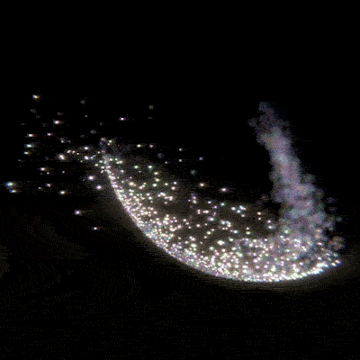

# Blender-to-Unity Particle Transfer
Blender to Unity Particle Transfer is a little two-part tool that exports particle system from Blender and imports to Unity.

The Blender folder contains a demo Blender file with a simple particle animation.
The UnityParticleImporter contains the Unity Project (2020.3.12f) that imports the exported particle package.

Project work-in-progress.

